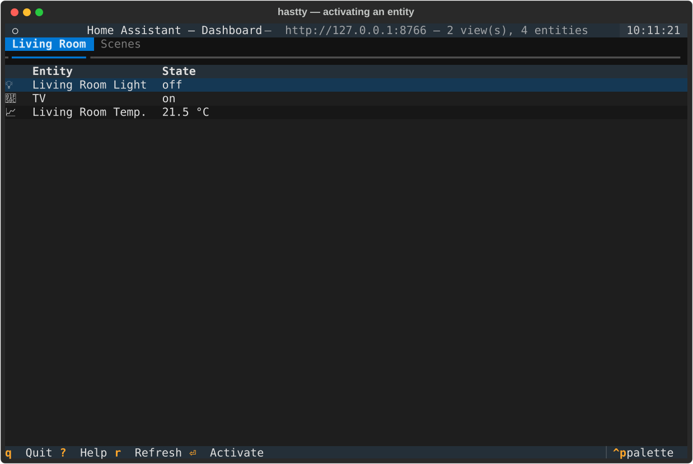
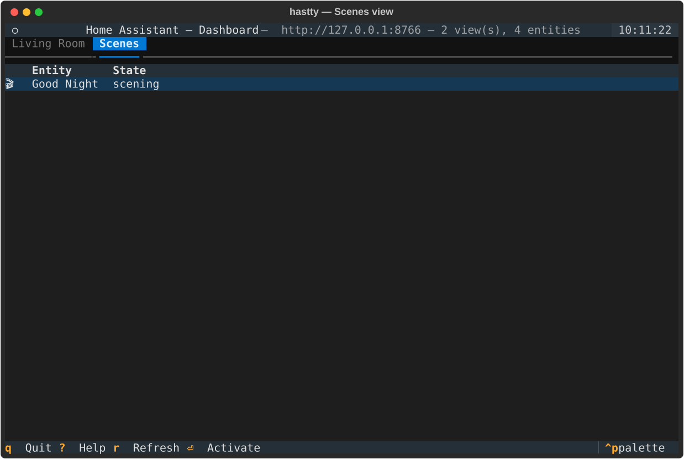
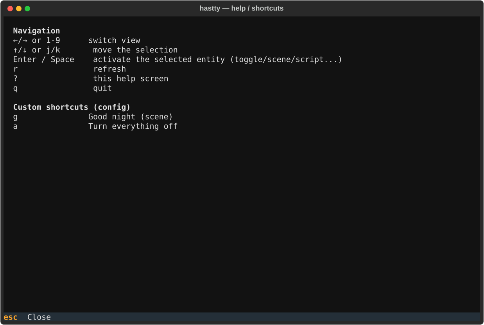

# hastty

[](https://github.com/jmleclercq/hastty/releases)
[](LICENSE)

**A terminal (TUI) viewer for your Home Assistant dashboards — with keyboard
shortcuts to trigger commands, no browser required.**

`hastty` mirrors your existing Lovelace views (same views, same entities, same
order) and lets you fire commands with the keyboard: toggle a light, run a
scene, trigger a script or an automation — all from the terminal, with live
state updates.

<p align="center">
  
</p>

## Features

- **Mirrors your Lovelace dashboards** — reuses the views and entities you
  already defined in Home Assistant, no separate dashboard to maintain.
- **Live state updates** — subscribes to `state_changed` events, no polling,
  no manual refresh needed.
- **Keyboard-first** — jump between views, move the selection, and fire
  commands, all without touching the mouse.
- **Custom global shortcuts** — bind any key to a specific service call
  (e.g. a scene or script) directly from a config file.
- **Single dependency on your side**: a Home Assistant Long-Lived Access
  Token. No add-on, no extra integration to install on the HA side.

## Screenshots

**Activating an entity** — toggling `switch.tv` with <kbd>Enter</kbd>, state updates live:



**Scenes view** — a second Lovelace dashboard, switched to with the <kbd>2</kbd> key:



**Help screen** — generic bindings plus the custom shortcuts from `config.yaml`:



*(Captured against a local mock Home Assistant server, see
[`tests/mock_ha_server.py`](tests/mock_ha_server.py) — no real HA instance
required to try it out.)*

## Installation

```bash
git clone https://github.com/jmleclercq/hastty.git
cd hastty
python3 -m venv .venv
source .venv/bin/activate
pip install -e .
```

## Configuration

You need two things: the URL of your Home Assistant instance, and a
**Long-Lived Access Token** (Home Assistant → your profile, bottom left →
Security tab → "Long-lived access tokens" → Create Token).

The simplest option — environment variables:

```bash
cp .env.example .env
# edit .env: HA_URL=http://homeassistant.local:8123  and  HA_TOKEN=...
```

Or generate a config file with custom keyboard shortcuts:

```bash
hastty --init-config
# edit ~/.config/hastty/config.yaml
```

The token can stay in `.env` (recommended, never committed) even if you use
the YAML file for shortcuts.

By default, only your **default** Lovelace dashboard is mirrored. If you use
several dashboards and want all of them, set `include_extra_dashboards: true`
under `homeassistant:` in `config.yaml`.

## Run

```bash
hastty
```

## Usage

| Key | Action |
|---|---|
| `1`–`9` | Jump directly to view N (in the order of your HA dashboards) |
| `←` / `→` | Previous / next view |
| `↑` / `↓` | Move the selection in the table |
| `Enter` / `Space` | Activate the selected entity (toggle light/switch, run a scene/script, trigger an automation...) |
| `r` | Refresh (re-syncs views and states) |
| `?` | Help (also lists your custom shortcuts) |
| `q` | Quit |

### Custom shortcuts

In `config.yaml`, under `keybindings`, you can define global keys (active
from any view) that call a service directly — for example a scene or a
script — without navigating to the entity first:

```yaml
keybindings:
  - key: "g"
    description: "Good night (scene)"
    service: "scene.turn_on"
    target:
      entity_id: scene.good_night

  - key: "a"
    description: "Turn everything off (script)"
    service: "script.turn_on"
    target:
      entity_id: script.turn_everything_off
```

## How it works

- **Connection**: Home Assistant WebSocket API (`/api/websocket`),
  authenticated with a Long-Lived Access Token (`hastty/client.py`).
- **Dashboard mirroring**: calls `lovelace/config` for your default
  dashboard (and, if `include_extra_dashboards` is enabled, every dashboard
  from `lovelace/dashboards/list` too). Cards (`entities`, `glance`, `light`,
  `vertical-stack`, `grid`, etc.) — whether under a classic top-level
  `cards` list or under the newer per-section `sections` layout used by the
  default dashboard editor since Home Assistant 2024.9 — are flattened into
  per-view lists of `entity_id` (`hastty/lovelace.py`). The app doesn't try
  to reproduce the visual layout of the cards, only the view → entities
  organization.
- **Commands**: `call_service` over WebSocket, either through the generic
  per-domain action (Enter/Space on a selected entity) or through custom
  shortcuts (`keybindings` in the config).

## Known limitations

- `area` cards (without an explicit entity list) aren't resolved into
  individual entities yet.
- The generic action (Enter/Space) calls a default service based on the
  entity's domain (toggle for light/switch/fan..., turn_on for
  scene/script, trigger for automation...); for a precise command with
  parameters (color, brightness, cover position...), use a custom shortcut
  with `service_data`.

## Development

```bash
pip install -e .
python tests/test_integration.py     # end-to-end test against a mock HA server
python tests/capture_screenshots.py  # regenerate the SVG screenshots in assets/screenshots
```

## License

[MIT](LICENSE)
